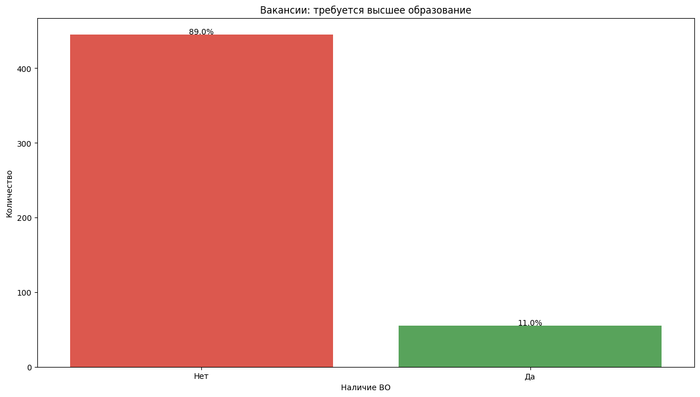
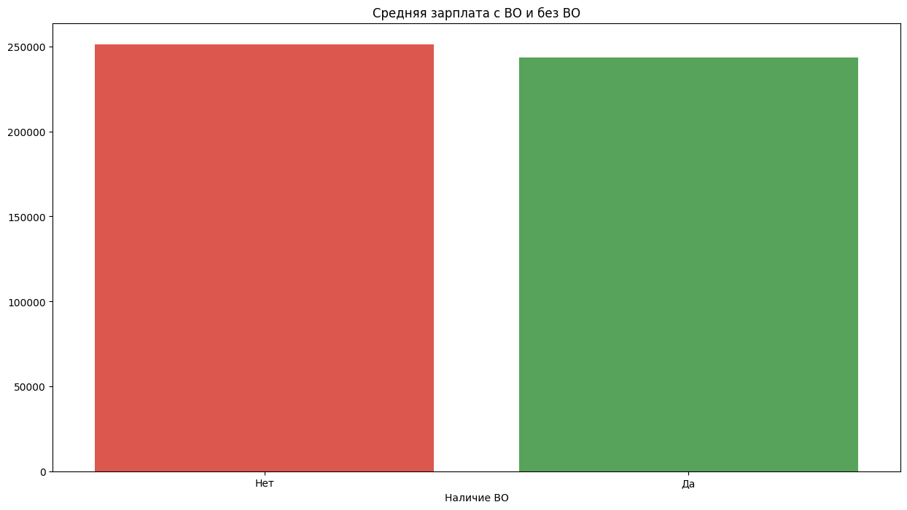
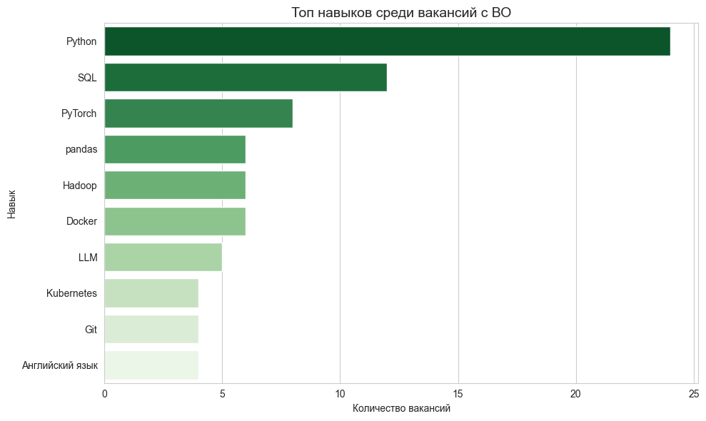
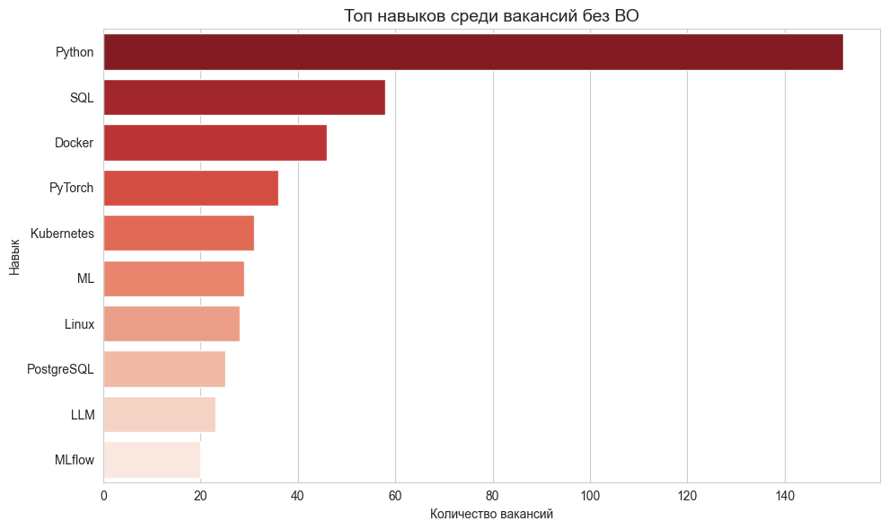

# HH.ru Parser & Analysis

## О проекте
Этот проект собирает вакансии с сайта hh.ru и анализирует требования к образованию, зарплаты и навыки.  
Цель — исследовать, насколько наличие высшего образования влияет на рынок труда в Москве.

##  Функционал
- Парсинг вакансий.
- Определение, требуется ли высшее образование.
- Сохранение данных в CSV.
- Анализ:
  - распределение вакансий (с высшим / без);
  - сравнение зарплат;
  - топ навыков;
  - частые обязанности;
  - требования по опыту.

##  Используемые технологии
- Python 3
- requests, pandas
- matplotlib, seaborn
- wordcloud

## Как запустить
1. Клонировать репозиторий
2. Установка зависимостей 
```bash
pip install -r requirements.txt
```
3. Выполнить все ячейки `searchWithoutHigher.ipynb`
4. Выполнить все ячейки `analysis.ipynb`

## Выводы

- Большая часть вакансий (89%) **не требует высшего образования**:




- В среднем **больше платят в вакансиях, не требующих высшего образования**:




- На первый взгляд навыки похожи, но:
  - В вакансиях с ВО чаще требуют **английский язык** и **Git**.
  - В вакансиях без ВО эти навыки менее важны.

- Сравнение топ навыков визуально (слева: с ВО, справа: без ВО):

<p float="left">
  
  
</p>
